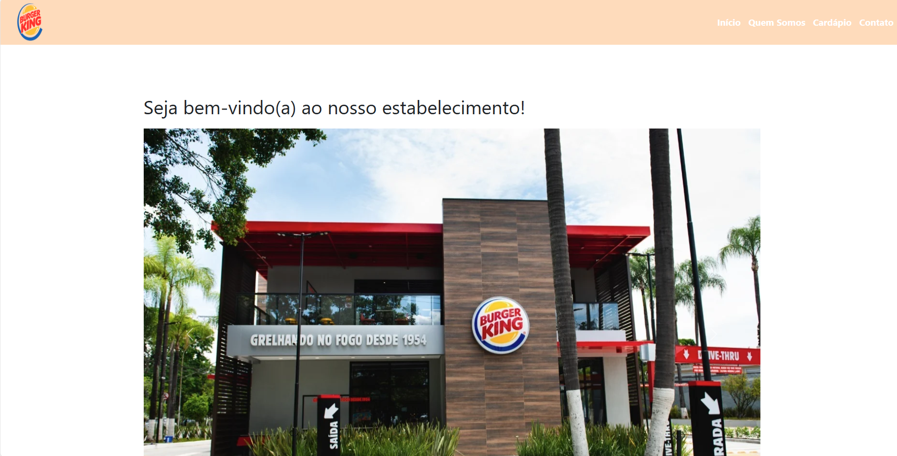
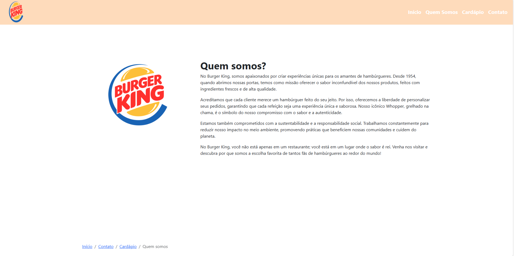
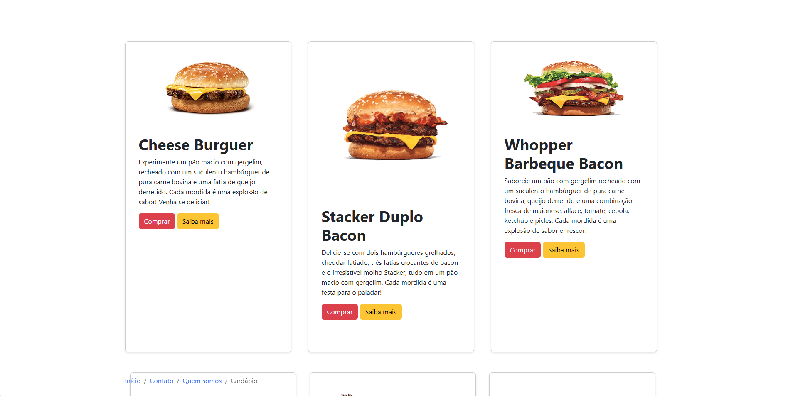
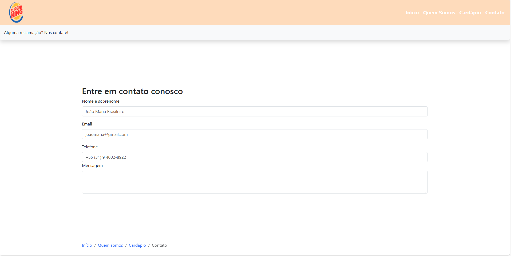
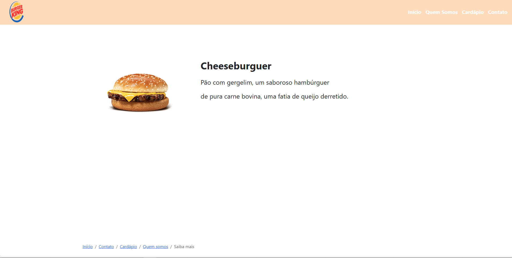

# site_bootstrap

## O que foi Utilizado:

Visual Studio Code: IDE utilizada para desenvolver o programa.

Boostrap: um framework web com código-fonte aberto para desenvolvimento de componentes de interface e front-end para sites e aplicações web, usando HTML, CSS e JavaScript, baseado em modelos de design para a tipografia.

